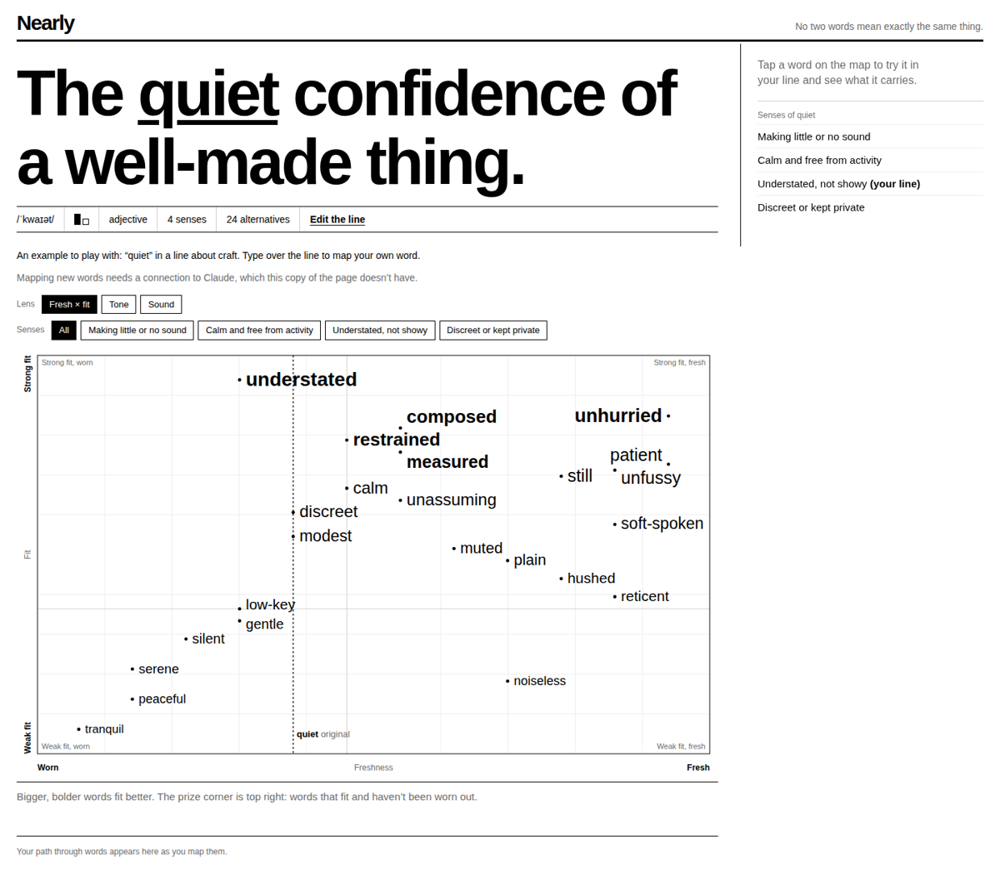

# Nearly

A word map for copywriters. Type a word, or paste the line it lives in, and Nearly plots the
alternatives on two scales: how well each one fits your line, and how worn out it is. Tap any
word and it swaps into your line so you can read it in place.

No two words mean exactly the same thing. This is a tool for finding out how they differ.



## What it does

- **The headline is the input.** The word, or the line, is set in giant type and you type
  straight into it. Paste a line and every word in it becomes tappable, so you choose which
  one to interrogate. Enter maps it; Escape cancels.
- **Three lenses.** Fresh against fit (the prize corner is top right), Tone (register against
  temperature), and Sound (fit against length, with each word's stress pattern drawn beside it).
- **The line is live.** Selecting a word rewrites your line at the top of the page, with the
  swapped word inverted. Copy it from there.
- **Shortlist.** Collect candidates across several maps and copy the set out in one go.
- **Senses.** Words are grouped by which meaning of the original they serve, so you can filter
  out the sense you don't mean.

Scores come from Claude's judgement, not a corpus. They are sound relative comparisons, but
"fresh 60" is an informed opinion, not a count of how often a word appears in advertising.

## Running it

The page is a single self-contained `index.html` with no build step and no dependencies. It
talks to Claude in one of two ways:

1. **Inside Claude.** Published as a Claude artifact, it uses the viewer's own connection, and
   each lookup draws on the viewer's Claude allowance. No key needed.
2. **Deployed.** Anywhere else, it posts to `/api/map`, a Vercel edge function that holds your
   Anthropic API key server side. The key is never sent to the browser.

Opened as a plain file with neither available, the example map still works and new lookups are
disabled with a note saying so.

## Deploying to Vercel

1. Push this repo to GitHub.
2. In Vercel, **Add New > Project**, import the repo. Framework preset: **Other**. No build
   command, no output directory. Vercel will serve `index.html` and turn `api/map.js` into a
   function automatically.
3. Under **Settings > Environment Variables**, add:

   | Name | Required | Notes |
   | --- | --- | --- |
   | `ANTHROPIC_API_KEY` | yes | From https://platform.claude.com |
   | `ACCESS_CODE` | no | If set, the page asks for this code before it will map anything |
   | `NEARLY_MODEL` | no | Defaults to `claude-sonnet-5-5` |
   | `NEARLY_MODEL_QUICK` | no | Defaults to `claude-haiku-4-5-20251001`, used for the detail panel |

4. Deploy.

To run it locally with the function working, install the Vercel CLI, put your key in a `.env`
file (copy `.env.example`), and run `vercel dev`. Without the CLI you can still open
`index.html` directly to see the example map.

## Protecting your key

A deployed instance spends your Anthropic credit on every lookup, and anyone with the URL can
make lookups. Before sharing the link, do one of these:

- **Vercel Deployment Protection** (Settings > Deployment Protection). Standard Protection
  limits the site to your Vercel team. This is the better option if the people using it have
  Vercel accounts.
- **`ACCESS_CODE`.** Set the variable to a passphrase. The page asks for it once and keeps it
  in the browser's local storage. Light protection, but enough to stop a leaked URL turning
  into a bill.

Also worth setting a monthly spend limit on your Anthropic account. A full map costs a few
cents; a scraped endpoint costs more.

## Files

```
index.html      the whole app: markup, styles, logic
api/map.js      Vercel edge function, proxies the Anthropic Messages API and streams the reply
.env.example    the variables to copy into .env for local development
docs/           screenshot
```

## Changing it

Everything the app knows about is near the top of the script in `index.html`:

- `DIMS` defines the six scales and their end labels.
- `LENSES` defines the three chip presets. Add a fourth by naming an `x` and `y` from `DIMS`.
- `buildPrompt()` is the instruction Claude follows when mapping a word. Edit the field
  descriptions there to change how words are scored, or to swap British spelling for American.
- `SEED` is the worked example that loads before any lookup.

## Licence

None set. Add one before making the repo public.
